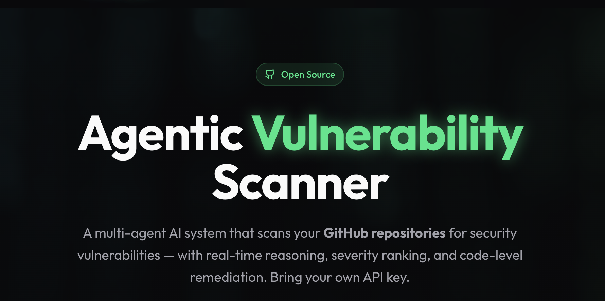
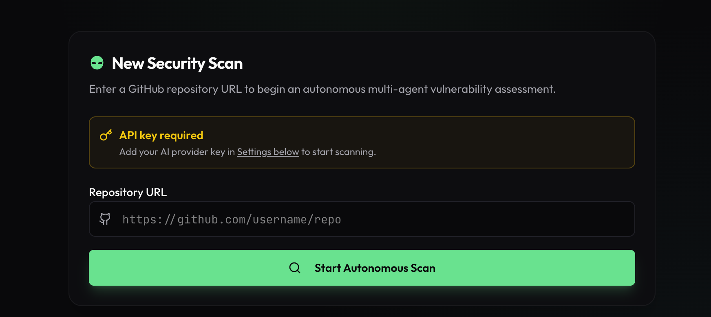

# Threat Legion

**An agentic, open-source vulnerability scanner for GitHub repositories — powered by your own AI API key.**



Threat Legion uses a multi-agent AI architecture to analyze public GitHub repositories for security vulnerabilities in real time. Five specialized agents run in parallel — each focused on a distinct attack surface — and stream findings to your screen as they are discovered.

No per-scan fees. Bring your own key from Anthropic, OpenAI, DeepSeek, or Groq.
---

## Features

- **Five-Agent Scanner** — A coordinator agent routes each file to a specialist: authentication, injection, secrets, dependencies, or general security.
- **Bring Your Own Key (BYOK)** — Connect Anthropic, OpenAI, DeepSeek, or Groq. Your key is stored encrypted and never leaves the server.
- **Real-Time Streaming** — Findings stream to the UI via Server-Sent Events as each agent reports them.
- **Actionable Remediation** — Every finding includes a code snippet, file path, line numbers, severity rating, and step-by-step fix instructions.
- **Public Repo Support** — Scan any public GitHub repository by URL.
- **Risk Scoring** — Each scan produces a risk score and severity breakdown (critical / high / medium / low).

---

## Tech Stack

### Frontend
| Technology | Version | Purpose |
|---|---|---|
| React | 19.1 | UI framework |
| Vite | 7.3 | Build tool & dev server |
| TypeScript | 5.9 | Type safety |
| TailwindCSS | 4.1 | Utility-first styling |
| Radix UI | latest | Accessible headless components |
| TanStack React Query | 5.90 | Data fetching & caching |
| Wouter | 3.3 | Lightweight client-side routing |
| React Hook Form + Zod | 7.55 / 3 | Form handling & validation |
| Framer Motion | 12.35 | Animations |
| Recharts | 2.15 | Data visualization |
| Sonner | 2.0 | Toast notifications |
| Lucide React | 0.545 | Icons |

### Backend
| Technology | Version | Purpose |
|---|---|---|
| Node.js | 24 | Runtime |
| Express | 5 | HTTP server & routing |
| TypeScript | 5.9 | Type safety |
| PostgreSQL | 16 | Primary database |
| Drizzle ORM | 0.45 | Type-safe ORM & migrations |
| Pino | 9 | Structured logging |
| Zod | 4 | Schema validation |

### AI / LLM
| Provider | Default Model |
|---|---|
| Anthropic | claude-sonnet-4-6 |
| OpenAI | gpt-4o |
| DeepSeek | deepseek-chat |
| Groq | llama-3.3-70b-versatile |

### Tooling
| Tool | Purpose |
|---|---|
| pnpm workspaces | Monorepo package management |
| esbuild | Production bundle |
| Orval | OpenAPI → React Query + Zod codegen |
| tsx | TypeScript execution in dev |

---

## Project Structure

```
threat-legion/
├── artifacts/
│   ├── api-server/              # Express backend
│   │   └── src/
│   │       ├── app.ts           # Express setup, CORS, middleware
│   │       ├── index.ts         # Server entry point
│   │       ├── routes/          # auth, scans, subscription, health
│   │       ├── middlewares/     # Auth middleware
│   │       └── lib/
│   │           ├── scan-engine.ts   # Five-agent orchestrator
│   │           ├── ai-provider.ts   # Multi-provider LLM abstraction
│   │           ├── github.ts        # GitHub API (file tree, content)
│   │           └── scan-bus.ts      # SSE event publishing
│   │
│   └── threat-legion/           # React frontend
│       └── src/
│           ├── pages/           # home, dashboard, scan-progress, scan-results, pricing
│           ├── components/      # UI components + Radix UI wrappers
│           ├── hooks/           # Custom React hooks
│           └── lib/             # Utilities
│
├── lib/
│   ├── db/                      # Drizzle schema + migrations
│   │   └── src/schema/          # users, scans, findings, sessions
│   ├── api-spec/                # OpenAPI 3.1 specification
│   ├── api-client-react/        # Auto-generated React Query hooks
│   ├── api-zod/                 # Auto-generated Zod schemas
│   ├── integrations-anthropic-ai/   # Anthropic SDK helpers
│   └── integrations-openrouter-ai/  # OpenRouter integration
│
├── scripts/                     # Utility scripts
├── pnpm-workspace.yaml
├── tsconfig.base.json
└── package.json
```

---

## Getting Started

### Prerequisites

- **Node.js** 24+
- **pnpm** (required — npm and yarn are blocked by the preinstall script)
- **PostgreSQL** 16+

Install pnpm if you don't have it:
```bash
npm install -g pnpm
```

---

### 1. Clone the Repository

```bash
git clone https://github.com/dorman/threat_legion.git
cd threat_legion
```

### 2. Install Dependencies

```bash
pnpm install
```

### 3. Configure Environment Variables

Create a `.env` file in the project root or export the following variables:

```env
# Server
PORT=5000
NODE_ENV=development
BASE_PATH=/

# Database
DATABASE_URL=postgres://localhost/threat_legion
```

**Variable reference:**

| Variable | Required | Description |
|---|---|---|
| `PORT` | Yes | HTTP server port |
| `NODE_ENV` | No | `development` or `production` |
| `BASE_PATH` | Yes | Base URL path (usually `/`) |
| `DATABASE_URL` | Yes | PostgreSQL connection string |
| `GITHUB_TOKEN` | No | GitHub token for higher API rate limits |

> **Note:** AI provider keys (Anthropic, OpenAI, DeepSeek, Groq) are entered by each user through the dashboard UI — they are never set as server environment variables.

### 4. Set Up the Database

```bash
# Create the database
createdb threat_legion

# Push schema (applies all migrations)
pnpm --filter @workspace/db run push
```

### 5. Start the Development Servers

Open two terminal windows:

**Backend (Express API on port 5000):**
```bash
pnpm --filter @workspace/api-server run dev
```

**Frontend (Vite dev server on port 3000):**
```bash
pnpm --filter @workspace/threat-legion run dev
```

Then open [http://localhost:3000](http://localhost:3000) in your browser.

---

## How to Use



1. **Open the dashboard** and go to AI Settings.
2. **Choose your AI provider** (Anthropic, OpenAI, DeepSeek, or Groq) and enter your API key.
3. **Paste a public GitHub repository URL** into the scan input (e.g. `https://github.com/owner/repo`).
4. **Start the scan.** The five agents will begin analyzing the repository in parallel.
5. **Watch findings stream in** as each agent reports vulnerabilities.
6. **Review the full report** — each finding includes severity, affected file, line numbers, a code snippet, and remediation steps.

---

## How the Scanner Works

### Agent Architecture

When a scan starts, a **coordinator agent** fetches the repository's file tree and categorizes each file by security domain. Files are then dispatched to five specialized agents that run in parallel:

| Agent | Focuses On |
|---|---|
| **Auth** | Authentication, sessions, JWT, OAuth, access control |
| **Injection** | SQL injection, template injection, path traversal, command injection |
| **Secrets** | Hardcoded API keys, tokens, credentials in config and `.env` files |
| **Dependencies** | Outdated or vulnerable packages (`package.json`, `requirements.txt`, etc.) |
| **General** | Business logic, error handling, insecure patterns |

Each agent uses **forced tool calling** — the LLM must call a `report_finding` tool for every vulnerability it identifies, producing structured output with:

```json
{
  "severity": "high",
  "title": "SQL Injection in user query",
  "description": "...",
  "remediation": "...",
  "filePath": "src/db/users.ts",
  "codeSnippet": "..."
}
```

### Real-Time Streaming

Findings are published via Server-Sent Events (SSE) as they are discovered — not batched at the end. The frontend subscribes to `GET /api/scans/:id/stream` and renders each finding immediately.

### AI Provider Abstraction

The `ai-provider.ts` module normalizes tools and messages into a provider-agnostic format, then converts to either the Anthropic or OpenAI API format at call time. This means any supported provider can run the same five-agent architecture without changes to the scan engine.

---

## Available Scripts

```bash
# Type-check all packages
pnpm run typecheck

# Build all packages for production
pnpm run build

# Push database schema
pnpm --filter @workspace/db run push

# Regenerate API client & Zod schemas from OpenAPI spec
pnpm --filter @workspace/api-spec run codegen

# Run the backend in development
pnpm --filter @workspace/api-server run dev

# Run the frontend in development
pnpm --filter @workspace/threat-legion run dev
```

---

## API Overview

The full API is defined in [`lib/api-spec/openapi.yaml`](lib/api-spec/openapi.yaml). Key endpoints:

| Method | Endpoint | Description |
|---|---|---|
| `GET` | `/api/health` | Health check |
| `GET` | `/api/auth/me` | Current user |
| `POST` | `/api/auth/byok` | Save AI provider settings |
| `GET` | `/api/scans` | List all scans |
| `POST` | `/api/scans` | Start a new scan |
| `GET` | `/api/scans/:id` | Get scan + findings |
| `GET` | `/api/scans/:id/stream` | SSE stream for live findings |
| `DELETE` | `/api/scans/:id` | Delete a scan |

React Query hooks and Zod schemas for all endpoints are auto-generated by Orval from the OpenAPI spec into `lib/api-client-react/` and `lib/api-zod/`.

---

## Database Schema

| Table | Description |
|---|---|
| `users` | User accounts — tier, encrypted AI API key, provider preference |
| `scans` | Scan records — repo URL, status, risk score, finding counts |
| `findings` | Individual vulnerabilities — severity, title, file path, line numbers |
| `sessions` | PostgreSQL-backed session store |

---

## Contributing

1. Fork the repository
2. Create a feature branch: `git checkout -b feature/your-feature`
3. Make your changes and run `pnpm run typecheck`
4. Commit: `git commit -m "feat: your feature description"`
5. Push and open a pull request

---

## License

MIT
