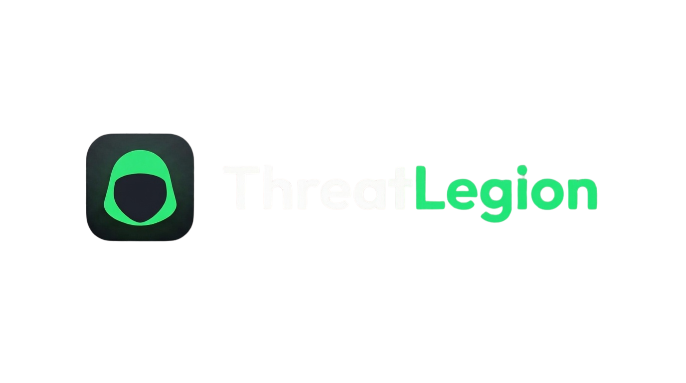
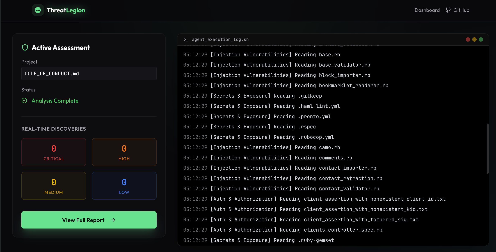

# Threat Legion

**Security for apps built with Cursor, agents, and RAG — powered by your own AI API key.**



Threat Legion scans AI-assisted codebases for the risks that generic scanners miss: prompt injection, RAG tenant leaks, over-powered agent tools, and secrets in Cursor rules. Upload a project folder or ZIP, or run **`threat-legion scan --ci`** in your pipeline to scan only changed files.

Seven specialist agents review auth on LLM routes, prompt surfaces, retrieval code, MCP/tool configs, secrets, and AI stack dependencies. Findings stream live via Server-Sent Events.

No per-scan fees. Bring your own key from Anthropic, OpenAI, DeepSeek, Groq, MiniMax, or Gemini.

---

## Features

- **AI-app scan profile** — Seven specialists tuned for Cursor, coding agents, and RAG pipelines (not generic OWASP checkbox scans).
- **Upload or CI delta** — Full project scans from the dashboard; changed-file scans via CLI and GitHub Action.
- **Bring Your Own Key (BYOK)** — Your key is encrypted server-side and only used during scans.
- **Real-time streaming** — Findings appear in the UI as each specialist reports them.
- **Actionable remediation** — Severity, file path, line numbers, code snippets, and fix guidance.
- **AI surface detection** — Prioritizes `.cursor/`, `AGENTS.md`, RAG routes, and tool/MCP configs.

---

## Tech Stack

### Frontend
| Technology | Purpose |
|---|---|
| React 19 | UI framework |
| Vite 7 | Build tool & dev server |
| TypeScript | Type safety |
| TailwindCSS 4 | Styling |
| Radix UI | Accessible components |
| Wouter | Client-side routing |
| React Hook Form + Zod | Forms & validation |

### Backend
| Technology | Purpose |
|---|---|
| Node.js + Express 5 | API server |
| PostgreSQL + Drizzle ORM | Database & migrations |
| Pino | Structured logging |

### Scan engine
| Package | Purpose |
|---|---|
| `lib/scan-core` | Shared scan orchestrator with `ai-app` and `general` profiles |
| `artifacts/cli` | `threat-legion scan` for local and CI use |

### AI providers (BYOK)
Anthropic · OpenAI · DeepSeek · Groq · MiniMax · Google Gemini

---

## Project Structure

```
threat_legion/
├── artifacts/
│   ├── api-server/          # Express backend (upload scans, SSE, auth)
│   ├── cli/                 # threat-legion CLI
│   └── threat-legion/       # React dashboard
├── lib/
│   ├── scan-core/           # AI-app scan engine + profiles
│   ├── db/                  # Drizzle schema
│   ├── api-spec/            # OpenAPI spec + Orval codegen
│   ├── api-client-react/    # Fetch client + lightweight React hooks
│   └── api-zod/             # Generated Zod schemas
└── .github/actions/scan/    # Composite GitHub Action
```

---

## Getting Started

### Prerequisites

- **Node.js** 20+ (24 recommended)
- **PostgreSQL** 14+
- **pnpm** (required — npm/yarn are blocked)

### Quick start

```bash
git clone https://github.com/dorman/threat_legion.git
cd threat_legion
./setup.sh
pnpm dev
```

Open [http://localhost:3000](http://localhost:3000). The API runs on port **8080** by default (macOS often reserves 5000 for AirPlay).

### Configure your AI key

In the dashboard **AI Provider Settings**, choose a provider and paste your API key. It is encrypted in the database and never returned to the browser.

### Scan a project

1. Upload a folder or ZIP (include `.cursor/`, agent configs, and RAG code if present).
2. Click **Run AI-App Scan**.
3. Watch specialists report findings live.
4. Review the full report with severity and remediation.



### CI / pull requests

```bash
pnpm threat-legion scan --ci --base origin/main --head HEAD
```

See `.github/workflows/delta-scan.example.yml` for a GitHub Action template.

---

## Environment variables

| File | Variable | Default | Description |
|---|---|---|---|
| `artifacts/api-server/.env` | `PORT` | `8080` | Backend HTTP port |
| `artifacts/api-server/.env` | `DATABASE_URL` | `postgres://localhost/threat_legion` | PostgreSQL connection |
| `artifacts/threat-legion/.env` | `API_PORT` | `8080` | Proxy target for `/api` in local dev |

AI provider keys are set per user in the dashboard, not via environment variables.

---

## How the scanner works

1. **Coordinator** classifies files into AI-app domains (auth, injection, RAG, agents, secrets, deps, general).
2. **Seven specialists** run in parallel (max 3 concurrent), each with domain-specific prompts.
3. **AI surface merge** — `.cursor/`, `AGENTS.md`, and agent/RAG paths are included even in delta scans.
4. **Synthesizer** produces a score (0–100) and executive summary.
5. **SSE stream** — `GET /api/scans/:id/stream` pushes logs and findings to the dashboard.

---

## Scripts

```bash
pnpm dev                              # API + frontend
pnpm run typecheck                    # Type-check all packages
pnpm run build                        # Production build
pnpm threat-legion scan --profile ai-app   # CLI scan
pnpm --filter @workspace/api-spec run codegen   # Regenerate API client from OpenAPI
pnpm --filter @workspace/db run push  # Push database schema
```

---

## API

Defined in [`lib/api-spec/openapi.yaml`](lib/api-spec/openapi.yaml). Key routes:

| Method | Endpoint | Description |
|---|---|---|
| `GET` | `/api/auth/me` | Current user |
| `POST` | `/api/auth/ai-settings` | Save BYOK settings |
| `GET` | `/api/scans` | List scans |
| `POST` | `/api/scans` | Upload project and start scan |
| `GET` | `/api/scans/:id` | Scan + findings |
| `GET` | `/api/scans/:id/stream` | Live SSE stream |

The frontend uses generated fetch functions and small React hooks in `lib/api-client-react/` (no TanStack Query).

---

## License

MIT
